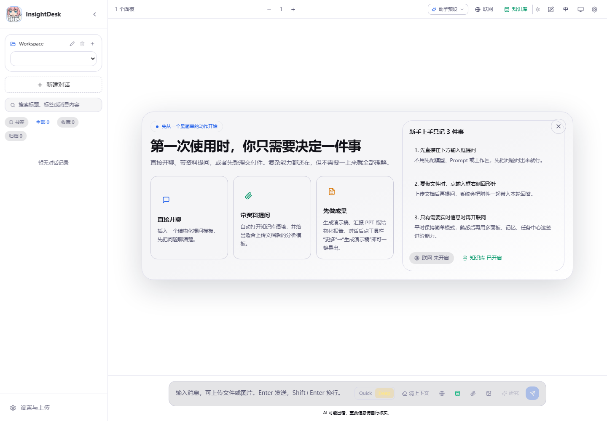

# InsightDesk

语言 / Language: [中文](./README.md) | [English](./README.en.md)

InsightDesk 是一个面向企业知识问答、资料分析、联网研究和结果交付的 AI 工作台。
它把聊天、知识库检索、附件分析、会话记忆、异步任务、报告生成和 PPT 交付整合在同一个项目里。

## 界面预览



## 核心能力

- 多工作区、多会话、多面板对话与多模型对比。
- 知识库导入与检索，支持 PDF、Word、Markdown、CSV、Excel 等资料。
- 附件问答、附件转知识库、会话记忆和阶段性总结。
- Web Research、引用面板、研究归档和跨档案冲突审校。
- 写作 Agent、质量审核 Agent、人工审批门控和任务中心。
- 报告、Deck、PPTX/PDF 交付与证据导出 gate。
- MCP 连接器、Integrations、身份/资源权限、安全审计和 Trace 运维。
- 支持本地 Ollama、云端模型、OpenAI-Compatible API 和 OpenRouter。

## 快速启动

```bash
copy .env.example .env
start.bat
```

打开前端：

```text
http://localhost:5173
```

手动启动：

```bash
venv312\Scripts\python.exe -m uvicorn backend.api_server:app --host 0.0.0.0 --port 8000

cd frontend
npm run dev -- --host 0.0.0.0 --port 5173
```

如果 Windows 保留了 `8000` 端口，可以换一个后端端口并同步设置 `BACKEND_PORT`。

## 常用配置

- 本地模型：`LLM_PROVIDER=ollama`、`OLLAMA_BASE_URL`、`OLLAMA_MODEL`
- 云端模型：`OPENAI_API_KEY`、OpenRouter 或 OpenAI-Compatible 配置
- 联网搜索：`TAVILY_API_KEY`，可选 `SEARXNG_URL`
- 远程访问：`APP_AUTH_TOKENS_JSON`、`ADMIN_API_TOKEN`
- 分享与安全：`SHARE_LINK_SECRET`、审计和安全状态配置

## 文档入口

- [中文功能说明书](./docs/USER_MANUAL.md)
- [English user manual](./docs/USER_MANUAL.en.md)
- [中文文档导航](./docs/README.md)
- [English documentation map](./docs/README.en.md)
- [当前交付状态](./docs/DELIVERY_STATUS.md)
- [快速开始](./QUICKSTART.md)
- [部署运维](./docs/DEPLOYMENT_OPERATIONS.md)
- [发布验证](./docs/VALIDATION.md)

## 当前状态

此前跟踪的 11 个剩余板块已经完成代码和产品收口。当前只剩一个非代码决策：
是否接受归档 ARQ 证据，并批准默认任务后端从 `memory` 切到 `arq`。

最新交付状态以 [docs/DELIVERY_STATUS.md](./docs/DELIVERY_STATUS.md) 为准。

