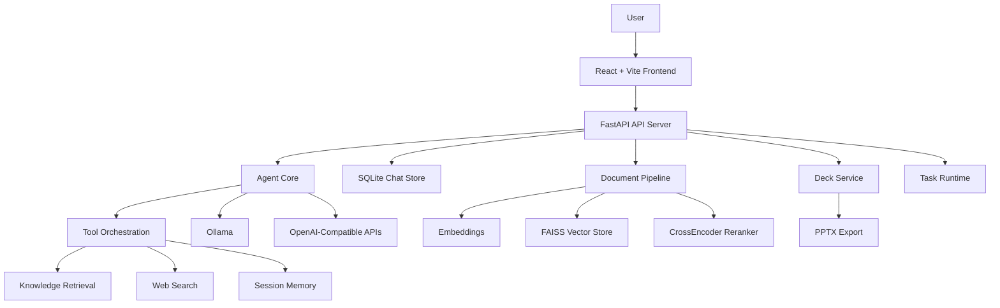

# AI 智能体项目介绍

## 一句话说明

这是一个面向企业知识问答、资料分析与结果交付的 AI 工作台，基于 `React + FastAPI + LangChain + LangGraph` 构建，支持本地模型与云端模型双模式运行，覆盖“提问、检索、分析、沉淀、生成报告/演示稿”的完整链路。

## 项目定位

很多 AI 项目只解决“回答问题”，这个项目更强调“完成工作”。

它不是一个单纯的聊天页面，也不是一个只做 RAG 检索的 Demo，而是一个可持续迭代的工程化智能体平台，核心目标包括：

- 将企业内部文档转化为可检索、可引用、可追溯的知识资产
- 让用户围绕同一会话完成问答、附件分析、记忆沉淀与任务推进
- 将对话结果进一步结构化为报告、仪表盘卡片和 `PPTX` 演示稿
- 支持本地私有化模型和云端模型并存，适配不同成本、安全和算力场景

## 核心价值

- 面向业务交付，而不是只做模型试玩
- 前后端分层明确，已经具备持续演进为团队内部产品的基础
- 功能覆盖从知识入库到最终输出，减少“问完还要手工整理”的断层
- 保留工程可控性，支持本地部署、Docker 部署和 Windows 一键启动

## 当前能力概览

### 1. 智能问答工作台

- 支持多会话、多工作区管理
- 支持多面板并行对话，可用于多模型对比、不同参数策略对比
- 支持流式响应和前端实时展示
- 支持系统 Prompt 管理与激活切换

### 2. 知识库与检索增强

- 支持 `PDF / DOC / DOCX / TXT / Markdown / CSV / Excel` 等文档接入
- 支持文档切块、向量化、向量库持久化
- 检索链路采用 `FAISS` 粗排 + `CrossEncoder` 二段重排
- 支持知识库统计、健康检查、检索测试、Chunk 编辑与删除
- 回答结果可附带来源引用，便于校验与追溯

### 3. 附件分析与会话增强

- 支持聊天过程中上传附件与图片
- 支持围绕附件内容继续分析，而不是仅做一次性上传
- 支持附件提升为知识库任务
- 支持收藏、引用查看、消息反馈等增强能力

### 4. 会话记忆与沉淀

- 支持会话级记忆管理
- 支持手动固定关键结论、事实、决策
- 支持自动阶段总结，缓解长会话上下文膨胀
- 支持在记忆工作区中编辑、删除、二次发送到输入区

### 5. 任务中心与异步执行

- 支持异步任务创建、轮询、状态追踪
- 已覆盖知识库导入、附件入库、报告生成等任务场景
- 前端提供任务中心，便于查看执行进度和失败原因

### 6. 报告与演示稿交付

- 支持从会话内容生成结构化报告
- 支持生成 Deck 并编辑主题、内容与页面
- 支持导出 `PPTX`
- 支持会话与 Deck 分享链接

### 7. Agent 编排与可观测性

- 支持 `function_calling`、`langgraph`、`auto` 三种 Agent 模式
- 支持本地 `Ollama` 与 OpenAI-Compatible / OpenRouter 等云端模型
- 支持联网搜索工具与知识库工具协同
- 已接入 LangGraph 工作流可视化，前端可查看节点执行过程
- 预留 `MCP Server` 扩展目录，便于后续接入更多工具

## 架构概览



## 主要模块

- `frontend/`
  React 前端，负责工作区、会话、聊天面板、引用查看、附件工作区、记忆工作区、任务中心、Deck 预览与编辑等交互。

- `api_server.py`
  FastAPI 服务入口，提供 REST API、SSE 流式输出、分享、报告、知识库管理、任务调度等能力。

- `agent_core.py`
  智能体核心编排层，负责模型接入、工具路由、Agent 模式切换、引用组装、会话记忆注入等。

- `doc_pipeline.py`
  文档处理与检索链路，负责加载文档、切块、向量化、FAISS 持久化、召回与重排。

- `chat_store.py`
  SQLite 持久层，负责会话、消息、工作区、收藏、Prompt、会话记忆等数据管理。

- `deck_service.py`
  演示稿生成与导出模块，负责 Deck 结构生成、主题管理、页面重生成、`PPTX` 导出与持久化。

- `mcp_servers/`
  MCP 扩展工具目录，适合后续接入专有知识源或外部业务系统。

- `tests/`
  自动化测试目录，已覆盖 API、知识库、记忆、Deck、任务、附件、分享等主要能力。

## 技术栈

| 层级 | 技术 |
| --- | --- |
| 前端 | React、TypeScript、Vite、Tailwind CSS、Zustand |
| 后端 | FastAPI、Uvicorn |
| Agent | LangChain、LangGraph |
| 模型接入 | Ollama、OpenAI-Compatible API、OpenRouter |
| 检索 | FAISS、sentence-transformers、CrossEncoder |
| 数据存储 | SQLite |
| 文档处理 | pypdf、docx2txt、mammoth、unstructured、pandas |
| 导出能力 | python-pptx |
| 部署 | Windows 脚本、Docker、docker-compose |

## 文档结构

- [QUICKSTART.md](/f:/项目/AI智能体/QUICKSTART.md)
  最短启动路径。

- [docs/README.md](/f:/项目/AI智能体/docs/README.md)
  整体文档目录。

- [docs/GETTING_STARTED.md](/f:/项目/AI智能体/docs/GETTING_STARTED.md)
  安装、模型模式、首次运行与排错。

- [docs/AGENT_AND_WORKFLOW.md](/f:/项目/AI智能体/docs/AGENT_AND_WORKFLOW.md)
  Agent 模式、LangGraph、工作流可视化与实现边界。

- [docs/PRODUCT_ROADMAP.md](/f:/项目/AI智能体/docs/PRODUCT_ROADMAP.md)
  产品路线图、迁移方向与执行优先级。

- [docs/DECK_DELIVERY_PLAN.md](/f:/项目/AI智能体/docs/DECK_DELIVERY_PLAN.md)
  报告与 PPT 交付能力的演进方案。

- [docs/VALIDATION.md](/f:/项目/AI智能体/docs/VALIDATION.md)
  冒烟、回归与发布前校验。

## 适用场景

- 企业内部知识助手
- 规章制度、项目文档、培训资料问答
- 基于附件和资料的分析问答
- 多模型对比评估
- 汇报材料、分析报告、演示稿草稿生成
- 团队内部私有化 AI 工作台原型

## 当前工程边界

这个项目已经具备较完整的产品骨架，但当前定位更适合“团队内部可用的单机/轻量部署系统”，而不是开箱即用的企业级多租户 SaaS。现阶段边界主要包括：

- 默认以 `SQLite + 本地文件 + 本地 FAISS` 为主，适合单机部署
- 尚未形成完整的用户体系、鉴权体系、RBAC 权限模型与审计日志
- 检索与任务运行仍以单服务进程为中心，未做分布式拆分
- 联网搜索依赖外部 API Key，例如 `TAVILY_API_KEY`
- 生产化监控、限流、告警、链路追踪能力仍有继续增强空间

## 推荐演进方向

### P0：生产可用性补强

- 增加鉴权、用户体系、权限隔离
- 增加统一审计日志与操作留痕
- 增加结构化监控、错误告警、任务观测
- 将关键配置改造为更明确的环境与运行时配置管理

### P1：架构升级

- 将会话存储迁移到 `PostgreSQL`
- 将缓存与异步任务状态迁移到 `Redis`
- 将知识库检索和任务执行拆分为独立服务
- 为分享、导出、文件处理增加更清晰的安全边界

### P2：产品能力增强

- 增加更完整的知识库治理和评测体系
- 增加组织级 Prompt、模板、工作流配置
- 增加更强的报告模板化与品牌化输出能力
- 增加 MCP 工具生态与业务系统连接器

## 快速启动

### 本地启动

```bash
python -m venv venv
venv\Scripts\activate
pip install -r requirements.txt

cd frontend
npm install
```

复制配置文件：

```bash
copy .env.example .env
```

启动后端：

```bash
python -m uvicorn api_server:app --host 0.0.0.0 --port 8000
```

启动前端：

```bash
cd frontend
npm run dev -- --host 0.0.0.0 --port 3000
```

### Windows 一键启动

项目根目录提供 `start.bat`、`setup.bat` 和 `一键启动.bat`，适合本地快速体验和团队内部演示。

### Docker 启动

```bash
copy .env.example .env
docker compose up --build -d
```

## 总结

这个项目的价值不在于“又做了一个聊天机器人”，而在于它已经把企业知识问答、附件分析、会话沉淀、任务执行和结果交付整合到了一个统一工作台里。  
如果后续补齐鉴权、监控、存储和部署能力，它完全可以继续演进为一个更稳定的企业内部 AI 应用底座。
