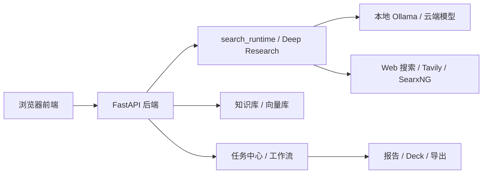
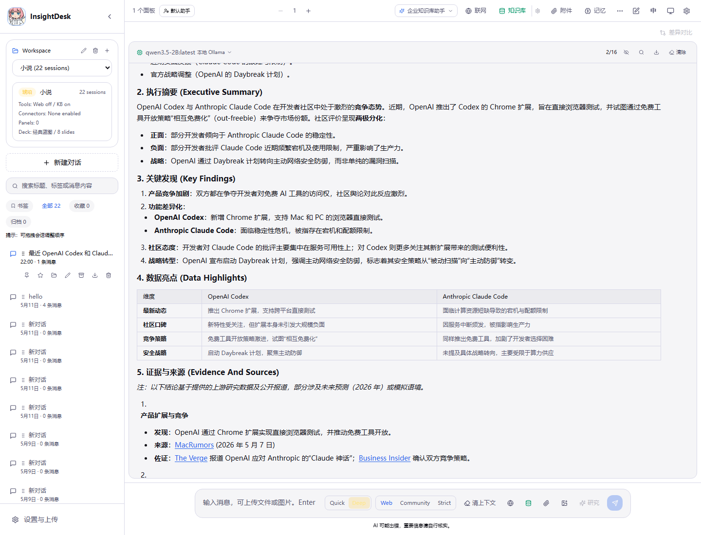

# InsightDesk

[](https://github.com/mzx866290-create/InsightDesk/actions/workflows/ci.yml)

语言 / Language: [中文](./README.md) | [English](./README.en.md)

InsightDesk 是一个可自托管的 AI 工作台，面向个人和小团队的知识问答、资料分析、Deep Research 和结果交付。
它把聊天、知识库检索、附件分析、会话记忆、异步任务、报告生成和 PPT 交付整合在同一个项目里，并支持本地 Ollama、云端模型和 OpenAI-Compatible 接口。

## 项目亮点

- 本地优先，可在 Windows / Docker / 本地 Python 环境中直接运行。
- 集成 Web Research 与 Deep Research，支持 Web、Community、Strict 等来源策略。
- 多工作区、多会话、多面板对话，适合比较不同模型和不同提示词效果。
- 任务中心统一管理研究、写作、审核和导出流程，适合演示“AI 工作流”能力。
- 支持知识库导入、附件分析、会话记忆和阶段性总结。
- 可生成报告、Deck、PPTX / PDF 等交付结果。

## 架构总览



## 界面预览




## 项目定位

这是一个个人维护、面向开源和自托管使用的 AI workbench。默认目标是本地可运行、代码边界清楚、关键安全能力可见。

- 桌面安装包不是当前交付阻塞项，优先保证 Web 前端和 Windows 启动脚本可用。
- 身份、组织和资源授权采用轻量方案，适合个人部署和开源展示。
- 生产告警与外部通知可按需接入，不作为个人部署的默认依赖。

## 核心能力

- 多工作区、多会话、多面板对话与多模型对比。
- 知识库导入与检索，支持 PDF、Word、Markdown、CSV、Excel 等资料。
- 附件问答、附件转知识库、会话记忆和阶段性总结。
- Web Research、引用面板、研究归档和跨档案冲突审校。
- 写作 Agent、质量审核 Agent、人工审批门控和任务中心。
- 报告、Deck、PPTX/PDF 交付与证据导出 gate。
- MCP 连接器、Integrations、身份/资源权限、安全审计和 Trace 运维。
- 支持本地 Ollama、云端模型、OpenAI-Compatible API 和 OpenRouter。

## 适合写进简历的描述

- 自研一套可本地部署的 AI 工作台，覆盖知识库问答、Deep Research、任务编排、报告生成和 PPT 交付。
- 支持本地 Ollama 与云端模型接入，并提供搜索增强、来源策略和多面板模型对比能力。

## Vercel 在线展示

这个仓库可以直接接到 Vercel 做前端展示页。

1. 在 Vercel 新建项目并连接当前 GitHub 仓库。
2. 点击 `Root Directory` 的 `Edit`，选择 `frontend` 作为部署根目录。
3. `Application Preset` 选择 `Vite`；如果没有自动识别，手动设置：

```text
Install Command: npm ci
Build Command: npm run build
Output Directory: dist
```

4. 如果要让在线 Demo 真的可交互，再配置一个独立后端地址，例如 Render、Railway 或 VPS 上的 FastAPI 服务。
5. 在 Vercel 环境变量里设置：

```dotenv
VITE_API_BASE_URL=https://你的后端域名/api
```

不填这个变量时，本地开发仍默认走 `/api`，不会影响现有 `start.bat` 和本地联调。
线上展示如果暂未配置后端，会自动进入前端演示模式：可以新建临时对话并查看交互界面，但不会真正调用模型、知识库或联网研究。

## 快速启动

```bash
copy .env.example .env
start.bat
```

打开前端：

```text
http://localhost:5173
```

手动启动：

```bash
venv312\Scripts\python.exe -m uvicorn backend.api_server:app --host 0.0.0.0 --port 8000

cd frontend
npm run dev -- --host 0.0.0.0 --port 5173
```

如果 Windows 保留了 `8000` 端口，可以换一个后端端口并同步设置 `BACKEND_PORT`。

### 一键验证前后端联通

```powershell
powershell -ExecutionPolicy Bypass -File scripts\check_frontend_backend_connectivity.ps1
```

该脚本会临时启动后端与 Vite 前端，验证后端 API、前端首页和 Vite `/api` 代理均返回 `200`，结束后自动清理测试进程。

### 本地模型运行示例：Ollama + Deep Research

以下示例使用本地 Ollama 模型运行一次联网深度研究，适合验证“本地模型 + 搜索增强 + 任务中心”的完整链路。

1. 确认 Ollama 已启动，并且本机已有可用模型：

```powershell
ollama list
```

2. 在 `.env` 中配置本地模型和搜索能力：

```dotenv
LLM_PROVIDER=ollama
OLLAMA_BASE_URL=http://localhost:11434
OLLAMA_MODEL=qwen3.5-2B:latest

# 可选：用于 Web Research / Deep Research
TAVILY_API_KEY=你的 Tavily Key
```

3. 启动后端与前端：

```powershell
venv312\Scripts\python.exe -m uvicorn backend.api_server:app --host 0.0.0.0 --port 8000

cd frontend
npm run dev -- --host 0.0.0.0 --port 5173
```

4. 打开 `http://localhost:5173`，在输入框选择：

- 研究模式：`Deep`
- 来源策略：`Community` 或 `Web`

示例问题：

```text
最近 OpenAI Codex 和 Claude Code 在开发者社区的评价如何？
```

一次成功运行后，任务会以 `multi_agent_workflow` 的形式进入任务中心，完成后把研究结果写回当前会话。`Community` 不是直接调用 X API，也不承诺完整覆盖社交平台；它只是让深度研究在常规网页检索中更关注社区、论坛和社交平台被搜索引擎索引到的线索，并要求用更稳定的来源交叉核验。

## 常用配置

- 本地模型：`LLM_PROVIDER=ollama`、`OLLAMA_BASE_URL`、`OLLAMA_MODEL`
- 云端模型：`OPENAI_API_KEY`、OpenRouter 或 OpenAI-Compatible 配置
- 联网搜索：`TAVILY_API_KEY`，可选 `SEARXNG_URL`
- 远程访问：`APP_AUTH_TOKENS_JSON`、`ADMIN_API_TOKEN`
- 分享与安全：`SHARE_LINK_SECRET`、审计和安全状态配置

## 文档入口

- [中文功能说明书](./docs/USER_MANUAL.md)
- [English user manual](./docs/USER_MANUAL.en.md)
- [中文文档导航](./docs/README.md)
- [English documentation map](./docs/README.en.md)
- [当前交付状态](./docs/DELIVERY_STATUS.md)
- [快速开始](./QUICKSTART.md)
- [贡献指南](./CONTRIBUTING.md)
- [Claude Code 协作指南](./CLAUDE.md)
- [部署运维](./docs/DEPLOYMENT_OPERATIONS.md)
- [发布验证](./docs/VALIDATION.md)

## 当前状态

项目已完成核心功能开发，默认使用本地内存任务队列，适合个人部署和本地使用。

如需更稳定的生产级异步任务处理，可按需切换到基于 Redis 的 `arq` 后端。

最新交付状态以 [docs/DELIVERY_STATUS.md](./docs/DELIVERY_STATUS.md) 为准。
