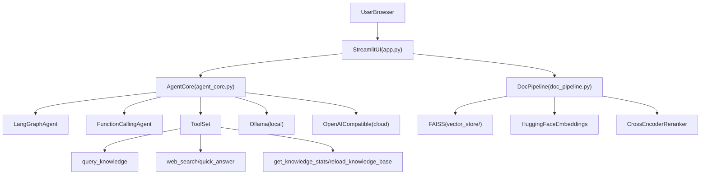

# 企业 AI 知识库系统 README（计划书版）

本文件用于描述当前项目版本的实现边界、阶段目标和优化路线，作为后续迭代的执行依据。

## 1. 项目定位与范围

本项目是一个面向企业内部知识问答场景的轻量系统，核心能力包括：

- 文档导入、分块、向量化与检索
- 基于工具调用的问答编排（知识库检索 + 联网搜索）
- 本地模型与云端模型切换
- 基于 Session 的多轮对话记忆

当前版本定位为单机可运行的工程化原型，重点是可用性和可扩展性，不包含多租户权限体系与分布式部署能力。

## 2. 当前版本能力边界

### 2.1 已实现能力

- UI 与交互：`Streamlit` 页面，支持模型配置、文档导入、对话交互
- 检索链路：`FAISS` 粗排 + `CrossEncoder` 二段重排
- Agent 模式：
  - `function_calling`（模型原生工具调用）
  - `langgraph`（轻量工具路由）
  - `auto`（本地/云端默认都使用 `langgraph`，兼容性优先）
- 对话记忆：基于 `session_id` 的会话级历史记录
- 工具集：知识检索、知识库统计、知识库重载、联网搜索、快速问答

### 2.2 当前限制

- 记忆存储为进程内内存，重启后丢失
- 未提供权限控制、审计日志和用户体系
- 联网搜索依赖外部 API Key（`TAVILY_API_KEY`）
- 向量库为本地存储，暂未支持分布式检索服务

## 3. 架构与代码映射（以当前代码为准）



模块对应关系：

- `app.py`：页面、会话状态、模型配置、文档上传入口、Agent 调用
- `agent_core.py`：模型工厂、工具定义、LangGraph/Function Calling 编排、会话记忆管理
- `doc_pipeline.py`：文档加载、文本切块、向量化、向量库持久化、Rerank 检索
- `mcp_servers/`：预留 MCP Server 扩展目录（当前运行主链路以内置工具为主）
- `vector_store/`：本地 FAISS 索引目录

## 4. 技术栈清单

| 层级 | 技术 |
|---|---|
| 语言/运行时 | Python 3.9+ |
| Web/UI | Streamlit |
| Agent 编排 | LangChain, LangGraph |
| 模型接入 | langchain-ollama, langchain-openai, langchain-openrouter |
| 检索与向量库 | FAISS, sentence-transformers |
| 重排模型 | CrossEncoder（默认 `BAAI/bge-reranker-base`） |
| 文档解析 | pypdf, docx2txt, unstructured |
| 网络请求 | httpx, requests |
| 配置管理 | python-dotenv |

## 5. 启动与运行（执行版）

### 5.1 环境准备

```bash
cd f:\项目\AI智能体
python -m venv venv
venv\Scripts\activate
pip install -r requirements.txt
```

复制配置：

```bash
copy .env.example .env
```

### 5.2 本地模型模式（推荐内网）

```env
LLM_PROVIDER=ollama
OLLAMA_MODEL=qwen2.5:7b
OLLAMA_BASE_URL=http://localhost:11434
TAVILY_API_KEY=your_tavily_api_key
```

确保本地模型服务可用：

```bash
ollama list
```

### 5.3 云端模式（OpenAI 兼容接口）

在 UI 中选择 `cloud`，并配置：

- `Model ID`（如 `qwen/qwen-2.5-72b-instruct`）
- `Base URL`（如 OpenRouter API 地址）
- `API Key`

### 5.4 启动方式

```bash
streamlit run app.py
```

或在 Windows 下使用：

```bash
.\start.bat
```

访问地址：`http://localhost:8501`

## 6. 里程碑与优化方向

### 6.1 里程碑划分

| 阶段 | 目标 | 当前状态 |
|---|---|---|
| M0 当前基线 | 单机 RAG + 双模式 Agent + 会话记忆 | 已完成 |
| M1 稳定性增强 | 可观测性、失败恢复、回归基线 | 进行中 |
| M2 检索质量提升 | 检索评测、参数调优、混合检索 | 规划中 |
| M3 工程化部署 | 容器化、外部会话存储、多实例支持 | 规划中 |

### 6.2 优先级排序（P0/P1/P2）

#### P0（优先立即执行）

1. 可观测性增强
   - 目标：定位 Agent 路由、工具调用和检索失败原因
   - 实现点：统一日志字段（session_id、tool_name、latency、error）
   - 验收：出现异常时可在 5 分钟内定位到模块级原因

2. 检索链路调优
   - 目标：提升答案相关性与稳定性
   - 实现点：暴露 `fetch_k`、`top_k` 配置；建立固定测试问题集
   - 验收：测试集平均相关性评分较当前基线提升

3. 会话记忆治理
   - 目标：避免长会话导致性能下降
   - 实现点：限制历史条数、增加手动重置策略、异常会话清理
   - 验收：长会话连续交互无明显卡顿，内存占用可控

#### P1（短期）

1. 混合检索能力
   - 目标：覆盖关键词明确但语义较弱的查询
   - 实现点：向量检索与关键词检索融合排序
   - 验收：关键词类问题命中率明显提升

2. 配置管理收敛
   - 目标：减少“UI 配置与 .env 配置”不一致导致的问题
   - 实现点：关键配置落盘与启动时提示校验
   - 验收：配置错误类问题显著减少

#### P2（中长期）

1. 会话存储外置化
   - 目标：支持重启后会话保留与多实例共享
   - 实现点：将内存历史迁移到 Redis/数据库
   - 验收：重启后可恢复会话上下文

2. 部署标准化
   - 目标：降低交付复杂度
   - 实现点：容器化、健康检查、基础监控
   - 验收：可通过标准部署脚本完成上线

## 7. 执行路线（任务模板）

后续每个优化项按以下模板执行：

- 目标：明确要解决的问题与成功标准
- 改动范围：涉及文件与模块（例如 `agent_core.py`、`doc_pipeline.py`）
- 实施步骤：分阶段实现，优先保持向后兼容
- 验收标准：必须可测试、可复现
- 风险与回滚：定义失败判定与快速回退方案

## 8. 回归与验收清单

每次迭代至少完成以下回归：

1. 启动回归
   - `streamlit run app.py` 可正常启动
   - UI 可加载且无阻塞异常
2. 核心功能回归
   - 文档上传后可完成向量化
   - 内部知识检索可返回来源片段
   - 联网搜索在配置 API Key 后可用
3. 模式回归
   - `local + langgraph` 可稳定回答
   - `cloud + function_calling` 可调用工具
4. 记忆回归
   - 同一 `session_id` 可追问
   - 清空/重置会话后行为符合预期

## 9. 常见问题（运维视角）

1. 启动后无法访问页面
   - 检查端口 `8501` 是否被占用
   - 检查虚拟环境与依赖是否完整安装

2. 本地模型不可用
   - 先执行 `ollama list` 验证服务状态
   - 确认 UI 中 `Base URL` 与模型名称一致

3. 检索为空或效果差
   - 确认已导入文档且向量库加载成功
   - 调整 `fetch_k` 与 `top_k` 并复测基线问题集

4. 联网搜索失败
   - 检查 `TAVILY_API_KEY` 是否已配置
   - 检查外网连通性与 API 配额

## 10. 版本说明

- 文档类型：执行计划版 README
- 适配代码：当前仓库主分支（`app.py` / `agent_core.py` / `doc_pipeline.py`）
- 维护方式：后续迭代完成后同步更新“里程碑状态”和“验收结果”
# Windows 一键启动

项目根目录新增了一个给非开发同事使用的入口：`一键启动.bat`。

推荐使用方式：
1. 配好 `.env`
2. 双击 `一键启动.bat`
3. 等待浏览器自动打开 `http://localhost:3000`

启动器会自动处理：
- 检查并尽量自动安装 `Python`、`Node.js`、`npm`
- 自动创建 `venv312` 并安装 `requirements.txt`
- 自动安装 `frontend/node_modules`
- 按 `LLM_PROVIDER` 自动检查 `Ollama` 或 `OpenRouter`
- 启动新版 `FastAPI + React`
- 打印本机和局域网访问地址

局域网共享说明：
- 本机访问：`http://localhost:3000`
- 局域网访问：`http://<启动机器IP>:3000`
- 如果其他同事无法访问局域网地址，优先检查同网段和 Windows 防火墙放行情况
