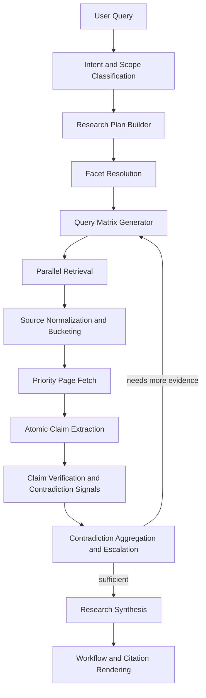

# Research Logic V2

## Purpose

This document defines the `web_research` upgrade from the current `v1` flow to a more evidence-driven `v2` research pipeline.

The goal is not to build a crawler. The goal is to make the current "web research" capability reliable enough for:

- time-sensitive topics
- industry research
- policy and regulatory tracking
- source-traceable summaries

---

## Why V2 Exists

The current implementation already has a usable deep-research skeleton in:

- `search_runtime/research_service.py`
- `search_runtime/service.py`
- `backend/api_task_execution_helpers.py`
- `frontend/src/components/workflow/WorkflowVisualizer.tsx`
- `frontend/src/components/chat/CitationPanel.tsx`

The issue is that the current flow is still closer to a multi-step search summarizer than a true research workflow.

### V1 strengths

- Supports quick mode and deep mode.
- Already performs multi-round search.
- Already ranks and deduplicates sources.
- Already fetches some page body content.
- Already stores workflow nodes and citations.

### V1 main gaps

- Query planning is too free-form and not domain-aware.
- Gap analysis is mostly based on snippets, not on verified evidence.
- Findings are not validated at claim level.
- Provider capability differences are not surfaced clearly.
- Time-sensitive research depends too much on keyword hints.
- The final output looks like a summary, not a research brief.

---

## Decision Summary

The following items are design decisions for `v2.1` and should not remain open during Phase 1:

1. Phase 1 remains domain-neutral, but uses a hybrid facet strategy:
   domain template override -> LLM-generated facets -> generic fallback facets.
2. Deep mode persists atomic claims and claim verification results.
3. Quick mode does not persist atomic claims.
4. Contradiction discovery starts inside claim verification.
5. The contradiction stage aggregates and escalates contradictions; it does not rediscover them from scratch.
6. External verification output uses `evidence_strength = high | medium | low`.
   Numeric confidence may exist internally, but it is not the primary product contract.
7. Default `latest` research window is `30d`, with stronger freshness preference inside `7d`.

---

## V1 Snapshot

### Current flow

```text
user query
  -> LLM generates 3 queries
  -> round 1 search
  -> LLM analyzes gaps
  -> optional round 2 search
  -> fetch a few pages
  -> LLM synthesizes summary/findings/contradictions
```

### Why this is not enough

For questions such as "最新金融行业动态", the system should decide:

- what counts as "latest"
- which sub-areas must be covered
- which source tiers are acceptable
- which claims require exact dates
- which results should be excluded even if they rank high

V1 does not model these decisions explicitly.

---

## V2 Goals

1. Make research output evidence-driven instead of prompt-driven.
2. Make time-sensitive topics date-aware by default.
3. Make research coverage structured by topic facets.
4. Make source quality and provider limitations visible.
5. Make each finding traceable to source-level evidence.
6. Keep compatibility with the current `quick` and `deep` task model.

## Non-goals

1. Do not build a crawler or general indexing system.
2. Do not depend on a single search provider.
3. Do not introduce multi-agent orchestration in the first V2 phase.
4. Do not turn every answer into a heavy research job.

---

## V2 Design Principles

### 1. Research must be structured before retrieval

The system should not jump directly from user query to free-form search terms.

It should first produce a normalized research plan with:

- intent
- time sensitivity
- region
- time window
- topic facets
- preferred source tiers
- required evidence strength

### 2. Research findings must be claim-based

The final report should not be built from raw snippets directly.

It should be built from atomic claims such as:

- `2026-03-06: PBOC governor stated that January aggregate financing grew 8.2% YoY.`
- `2026-02-27: CSRC held a capital-market planning symposium.`

Each atomic claim must carry its own evidence.

### 3. Source quality must be explicit

Every source should be labeled by:

- source tier
- source bucket
- source family
- freshness
- trust
- fetch status
- selection reason
- provider caveat

### 4. Provider capability gaps must be visible

If a provider cannot enforce `time_range`, `topic=news`, or raw page extraction, the system should record that as a research caveat instead of pretending the filter was applied.

### 5. The system must degrade gracefully under budget

Deep research is allowed to be heavier than quick mode, but it must obey hard budgets for:

- LLM calls
- fetched pages
- extracted claims
- verification passes
- total wall-clock time

When budgets are exceeded, the system should degrade with caveats instead of failing silently.

---

## V2 High-Level Flow



---

## V2 Detailed Pipeline

## Stage 1. Intent And Scope Classification

### Input

- raw user query
- optional provider selection
- optional user time range
- optional knowledge base context

### Output

```json
{
  "intent": "industry_research",
  "time_sensitive": true,
  "scope": "latest_updates",
  "region": "china",
  "language": "zh-CN",
  "time_window": "30d",
  "requires_exact_dates": true
}
```

### Notes

- This stage should be lightweight and mostly rule-based.
- Keywords such as `latest`, `recent`, `最新`, and `近况` should be handled deterministically.
- LLM should only fill gaps that rules cannot infer.
- `latest` defaults to `30d`, while ranking gives extra weight to sources inside `7d`.

---

## Stage 2. Research Plan Builder

### Purpose

Convert the user query into a structured research plan instead of directly generating 3 search terms.

### Output structure

```json
{
  "topic": "financial industry updates",
  "facets": [
    "macro_policy",
    "banking_insurance",
    "capital_markets",
    "cross_border_fx",
    "fintech_funding",
    "regulation_risk"
  ],
  "source_policy": {
    "primary_required": true,
    "max_low_trust_ratio": 0.2,
    "prefer_official": true
  },
  "evidence_policy": {
    "min_independent_families_per_claim": 2,
    "require_date_for_time_sensitive_claims": true,
    "require_primary_for_policy_claims": true
  }
}
```

### Policy consumption rules

The `source_policy` and `evidence_policy` fields are not advisory. They must be consumed later:

- Stage 5 enforces `max_low_trust_ratio` during source selection.
- Stage 8 enforces `min_independent_families_per_claim`.
- Stage 8 enforces `require_primary_for_policy_claims`.
- Stage 10 emits a caveat if the plan requirements could not be satisfied.

---

## Stage 3. Facet Resolution

### Purpose

Resolve where facets come from in a stable and testable way.

### Resolution order

1. Explicit domain template match.
2. LLM-generated facets constrained by schema.
3. Generic fallback facets.

### Phase 1 behavior

Phase 1 is domain-neutral, but supports optional domain templates.

That means:

- a finance-oriented query may match a finance template if available
- a non-templated query still works through constrained LLM facet generation
- if LLM facet generation fails, the system falls back to generic facets such as:
  - market structure
  - policy and regulation
  - data and metrics
  - funding and corporate activity
  - risks and controversies

### Why this resolves the earlier ambiguity

We do not need to choose between "only domain-neutral" and "finance hard-coded".

The system uses a hybrid strategy:

- templates improve stability where available
- LLM keeps the system flexible
- generic fallback keeps the flow testable

### Suggested template contract

```json
{
  "template_id": "finance",
  "match_terms": ["banking", "insurance", "capital market", "fintech", "金融", "银行", "证券"],
  "facets": [
    "macro_policy",
    "banking_insurance",
    "capital_markets",
    "cross_border_fx",
    "fintech_funding",
    "regulation_risk"
  ]
}
```

---

## Stage 4. Query Matrix Generator

### Purpose

Generate query groups by source intent, not just by topic wording.

### Query groups

1. `official`
2. `policy`
3. `reports`
4. `news`
5. `data`

### Example

```json
{
  "official": [
    "site:gov.cn OR site:pbc.gov.cn OR site:nfra.gov.cn OR site:csrc.gov.cn 2026 finance policy updates"
  ],
  "reports": [
    "2026 China financial industry outlook banking insurance capital markets report"
  ],
  "news": [
    "2026 latest financial industry updates China"
  ],
  "data": [
    "site:stats.gov.cn 2026 Q1 financial sector value added"
  ]
}
```

### Rules

- Each facet should produce at least one query.
- Official and policy buckets should run first for time-sensitive research.
- News buckets should fill coverage gaps, not dominate conclusions.
- Query generation should carry `expected_source_tier` and `expected_signal`.

---

## Stage 5. Retrieval Execution

### Purpose

Execute grouped queries and preserve retrieval context.

### Required improvements

1. Keep query bucket metadata through the entire pipeline.
2. Record provider capabilities and caveats in runtime metadata.
3. Preserve query-to-source linkage for later verification.

### Provider capability model

Every provider should declare capabilities, for example:

```json
{
  "name": "duckduckgo",
  "supports_time_range": false,
  "supports_news_topic": false,
  "supports_answer": false,
  "supports_raw_content": false,
  "supports_domain_filter_native": false
}
```

### Why this matters

If a user asks for `latest`, but the active provider cannot enforce time filters, the system must emit a caveat such as:

`Current provider does not support strict time filtering; freshness is approximated by query hints and page dates.`

---

## Stage 6. Source Normalization And Bucketing

### Purpose

Turn mixed retrieval results into evaluated research sources.

### New source fields

```json
{
  "source_tier": "primary",
  "source_bucket": "official",
  "source_family": "pbc",
  "freshness_band": "7d",
  "selection_reason": "official_domain + fresh_source + title_term_match",
  "provider_caveat": "no_strict_time_filter"
}
```

### Suggested tiering

1. `primary`
   Government, regulator, central bank, exchange, official filings, official company IR.
2. `secondary`
   Reputable institutions, major financial media, research organizations.
3. `tertiary`
   Portals, reposts, aggregators, commentary sites.

### Source family rules

`source_family` is the unit used for independence checks.

The normalization rules should follow this order:

1. explicit family mapping table
2. normalized organization name
3. normalized effective domain
4. upstream attribution if the page is a repost or syndication

### Independence rules

Two sources are independent only if all of the following are true:

1. they belong to different `source_family`
2. they are not reposts or mirrors of the same upstream content
3. they are not two pages from the same organization repeating the same statement

### Examples

- same media site, two URLs: not independent
- wire story plus syndication pickup: not independent
- official release plus media commentary on the release: different families, but only one primary family
- official release plus repost of that release: not independent

### Selection rules

- Keep source diversity by domain and family.
- For time-sensitive research, fresh primary sources outrank high-score tertiary sources.
- A tertiary source can support context but should not anchor a major conclusion alone.
- If `max_low_trust_ratio` would be exceeded, tertiary sources become context-only and cannot by themselves upgrade a claim to `verified`.

---

## Stage 7. Priority Page Fetch

### Purpose

Fetch high-value pages before synthesis, not only at the end.

### Proposed strategy

1. Fetch top primary sources first.
2. Fetch sources that contain dates, numbers, or policy text.
3. Fetch supporting secondary sources only if needed for coverage or contradiction checks.

### Why V1 is weak here

V1 fetches a few pages late in the flow. That means many planning and verification decisions are still based on snippets.

---

## Stage 8. Atomic Claim Extraction

### Purpose

Extract small, verifiable claims from fetched content.

### Claim example

```json
{
  "claim_id": "claim-001",
  "facet": "macro_policy",
  "text": "2026-03-06: PBOC governor stated that January aggregate financing grew 8.2% YoY.",
  "claim_type": "data_point",
  "date": "2026-03-06",
  "candidate_sources": ["src-1", "src-3"]
}
```

### Claim types

- `event`
- `data_point`
- `policy_signal`
- `market_trend`
- `forecast`

### Claim extraction caps

- `max_candidate_claims`: default 24
- `max_claims_per_facet`: default 6
- `max_numeric_claims_per_source`: default 3

These caps prevent explosion during deep research.

---

## Stage 9. Claim Verification And Contradiction Signals

### Purpose

Score each claim by evidence strength and emit contradiction signals during the same pass.

### Verification rules

1. `verified`
   Claim satisfies the evidence policy for the claim type.
2. `partial`
   Claim is plausible but evidence is incomplete, single-family, stale, or indirectly supported.
3. `unverified`
   Claim lacks sufficient evidence, has unclear date, or depends on low-trust repetition.

### Claim-type-specific rules

1. Direct primary claim
   A fetched primary source with an exact attributable statement and date may be `verified` even without a second family.
2. Policy or regulatory interpretation
   Requires at least one primary source.
3. Market trend or synthesized conclusion
   Requires at least two independent families.
4. Number-heavy claim
   Must prefer body text over snippet text whenever body text is available.

### Output contract

External product output should prefer:

```json
{
  "claim_id": "claim-001",
  "status": "verified",
  "evidence_strength": "high",
  "supporting_sources": ["src-1", "src-3"],
  "verification_note": "primary central-bank statement plus independent secondary confirmation"
}
```

Numeric confidence may exist internally, but the main product surface should use:

- `high`
- `medium`
- `low`

### Contradiction signals

Contradiction detection begins here.

Signals include:

- different dates for the same event
- different values for the same metric
- secondary source interpretation conflicting with primary text
- same claim supported by mixed time windows

Each signal should be attached to the claim or claim cluster that triggered it.

---

## Stage 10. Contradiction Aggregation And Escalation

### Purpose

Aggregate contradiction signals and decide whether to continue retrieval.

### Possible outcomes

1. `no_action`
   Contradictions are minor or already explained.
2. `clarify_in_output`
   Contradictions remain, but extra search is unlikely to help.
3. `repair_search`
   Contradictions justify one targeted retrieval loop.

### Hard rule

Only one repair loop is allowed in Phase 1.

This prevents the system from entering unbounded search.

### Example

```json
{
  "topic": "fintech funding recovery",
  "details": "Global funding recovered, but China and APAC remained weak. The contradiction is about scope, not data integrity.",
  "resolution_action": "clarify_in_output",
  "sources": ["src-7", "src-9"]
}
```

---

## Stage 11. Research Synthesis

### Purpose

Produce a brief that is directly usable, not just a generic summary.

### Proposed output sections

1. `executive_summary`
2. `key_trends`
3. `verified_findings`
4. `contradictions`
5. `implications`
6. `source_notes`
7. `research_caveats`

### Output style rules

- Use exact dates for recent events.
- Separate verified facts from directional interpretation.
- Do not hide provider limitations.
- Prefer concise claims over long narrative paragraphs.
- If the evidence policy could not be fully satisfied, say so explicitly.

---

## Quick Mode Vs Deep Mode

The boundary between quick mode and deep mode must stay explicit.

### Quick mode

Quick mode is still lightweight and answer-oriented.

It should use:

- intent classification
- provider capability awareness
- lightweight query rewrite
- source scoring
- compact summary

Quick mode should not use:

- facet resolution
- claim extraction
- claim verification
- contradiction repair loop
- claim persistence

### Deep mode

Deep mode is research-oriented.

It should use the full V2 flow:

- intent classification
- research plan
- facet resolution
- query matrix
- source bucketing
- priority fetch
- claim extraction
- claim verification
- contradiction escalation
- structured synthesis

### Phase 1 impact matrix

| Phase 1 item | Quick mode | Deep mode |
| --- | --- | --- |
| provider capability metadata | yes | yes |
| intent classification | yes | yes |
| research plan | light | full |
| facet resolution | no | yes |
| query matrix | no | yes |
| claim persistence | no | no |

Phase 1 intentionally leaves claim persistence to Phase 2.

---

## Budgets, Timeouts, And Degradation

V2 quality gains are only acceptable if the system stays usable.

### Quick mode budgets

- max LLM calls: 2
- max fetched pages: 0 by default
- max search rounds: 1

### Deep mode budgets

- max LLM calls: 5
- max fetched pages: 6 by default, 10 hard cap
- max candidate claims: 24
- max verified findings in final output: 12
- max repair loops: 1

### Timeout policy

- provider search timeout: per provider config
- fetch timeout: existing page-fetch timeout
- claim verification timeout: stage-scoped timeout with fallback

### Degradation policy

If a stage exceeds budget or timeout:

1. fetch failure
   claim may fall back to snippet-based evidence and be capped at `partial`
2. verification timeout
   return evidence-ranked findings with `partial` or `unverified` status plus caveat
3. contradiction unresolved
   surface contradiction in output and stop after one repair loop
4. synthesis budget exceeded
   fall back to compact brief using verified claims only

---

## Persistence Strategy

This decision affects Phase 2 and Phase 3 and should be fixed now.

### Decision

Deep mode will persist:

- atomic claims
- claim verification results
- contradiction records
- research caveats

Quick mode will persist:

- final summary
- selected sources
- workflow nodes

### Why deep mode persists claims

Without persisted claims, the product cannot cleanly answer:

- why a finding is marked verified
- which sources supported a finding
- which contradiction blocked stronger verification

### Persistence granularity

The first implementation does not need a new standalone claims database.

Phase 2 may store claim artifacts inside the existing task/message result payloads, then normalize later if needed.

---

## V2 Data Model Changes

The system does not need a rewrite. It needs additive structures that can coexist with the current types.

### Proposed types

```python
@dataclass
class ResearchIntent:
    intent: str
    time_sensitive: bool
    region: str | None = None
    time_window: str | None = None
    requires_exact_dates: bool = False


@dataclass
class ResearchQuery:
    query: str
    facet: str
    bucket: str
    expected_source_tier: str
    provider_caveat: str = ""


@dataclass
class ResearchSource:
    doc: SearchDocument
    facet: str
    bucket: str
    source_tier: str
    source_family: str
    freshness_band: str
    selection_reason: str
    provider_caveat: str = ""


@dataclass
class AtomicClaim:
    claim_id: str
    facet: str
    text: str
    claim_type: str
    date: str | None = None
    candidate_sources: list[str] = field(default_factory=list)


@dataclass
class ClaimVerification:
    claim_id: str
    status: Literal["verified", "partial", "unverified"]
    evidence_strength: Literal["high", "medium", "low"]
    supporting_sources: list[str] = field(default_factory=list)
    verification_note: str = ""


@dataclass
class ResearchContradiction:
    topic: str
    details: str
    resolution_action: Literal["no_action", "clarify_in_output", "repair_search"]
    sources: list[str] = field(default_factory=list)
```

---

## UI And Workflow Changes

V2 should keep the current workflow panel and citation panel, but add more useful visibility.

### Workflow panel should show

- research classification
- active facet
- query bucket
- provider caveat
- verification progress
- repair-loop state when triggered

### Citation panel should show

- source tier
- source bucket
- source family
- freshness band
- selection reason
- provider caveat

### Why this matters

The user should be able to answer:

- Why was this source selected?
- Why is this finding marked verified?
- Why does the system say "latest" if the provider cannot enforce time filters?

---

## Incremental Rollout Plan

## Phase 1. Planning And Capability Awareness

Scope:

- add provider capability metadata
- add research intent and light research plan
- add facet resolution contract
- add query matrix generation for deep mode
- add budget and degradation hooks

Target files:

- `search_runtime/providers/base.py`
- `search_runtime/providers/duckduckgo_provider.py`
- `search_runtime/registry.py`
- `search_runtime/types.py`
- `search_runtime/research_service.py`

## Phase 2. Source And Claim Layer

Scope:

- add source tiering and `source_family`
- add early page fetch
- add atomic claim extraction
- add claim verification
- add contradiction aggregation
- persist deep-mode claim artifacts

Target files:

- `search_runtime/service.py`
- `search_runtime/research_service.py`
- `search_runtime/types.py`
- `backend/api_task_execution_helpers.py`

## Phase 3. Presentation And Persistence

Scope:

- expose richer research artifacts in API payloads
- upgrade workflow nodes
- upgrade citation rendering

Target files:

- `backend/api_task_execution_helpers.py`
- `frontend/src/stores/workflowStore.ts`
- `frontend/src/components/workflow/WorkflowVisualizer.tsx`
- `frontend/src/components/chat/CitationPanel.tsx`
- `frontend/src/api/client.ts`

---

## Success Criteria

V2 is successful if the system can consistently produce research output where:

1. major findings are facet-complete instead of skewed to one sub-topic
2. time-sensitive conclusions include concrete dates
3. primary sources visibly anchor policy or regulation claims
4. low-trust sources do not dominate the final summary
5. workflow and citations explain why evidence was selected
6. deep mode stays inside configured hard budgets and degrades explicitly when budgets are exceeded

---

## Remaining Open Questions

Only lower-risk questions should remain open after `v2.1`.

1. Whether provider capability metadata should be fully static or partly runtime-detected.
2. Whether template matching should use rules only in Phase 1 or rules plus a lightweight classifier.
3. Whether contradiction clustering should stay LLM-assisted or add more rule-based numeric matching in Phase 2.

---

## Recommended Next Implementation Order

1. Add provider capability declarations.
2. Introduce `ResearchIntent`, `ResearchQuery`, and budget config.
3. Add facet resolution with template override plus generic fallback.
4. Restrict Phase 1 deep-mode query planning to the new query matrix path.
5. Keep quick mode on the lightweight path, but make it capability-aware.
6. Begin Phase 2 only after the Phase 1 contracts are stable.

---

## Summary

V1 already has the right direction, but it is still centered on retrieval plus synthesis.

V2 shifts the center of gravity to:

`plan -> retrieve -> evaluate -> verify -> synthesize`

The `v2.1` refinements in this document make that shift implementable without blocking on unresolved questions during Phase 1.
