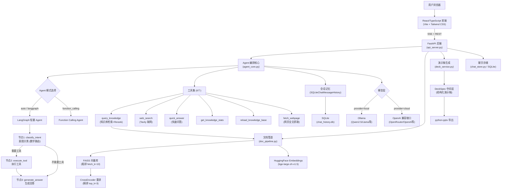

# 企业专属 AI 知识库系统

> 基于 LangChain + LangGraph + RAG + FastAPI 构建的企业知识库系统，支持本地部署与云端模型双模式，配备二段重排检索与多轮对话记忆，React 现代化前端，支持多模型并行对话与结构化演示稿生成。

---

## 项目定位

企业日常运营中积累了大量文档、政策、流程手册，但这些知识往往"沉睡"在文件夹里，难以快速检索和利用。本项目通过 RAG（检索增强生成）技术，将企业文档向量化存储，结合大语言模型实现自然语言问答，同时支持联网搜索补充外部信息，构建一套完整的企业智能知识助手。

**核心特性**：
- 双 Agent 模式（LangGraph 轻量模式 / Function Calling 模式）
- 二段重排检索（FAISS 粗排 + CrossEncoder 精排）
- 多轮对话记忆（SQLite 持久化，按 session_id 隔离）
- React 现代化前端，支持最多 6 个模型面板并行对话
- 结构化演示稿生成（DeckSpec 中间层 + 三栏编辑器）
- 仪表盘卡片（基于知识库证据的 ECharts 可视化）
- 多角色系统提示词管理，支持知识库绑定

---

## 技术架构



### 核心模块说明

| 模块 | 文件 | 职责 |
|------|------|------|
| 前端界面 | `frontend/` (React + Vite) | 多面板聊天、Deck 编辑器、设置管理 |
| API 服务 | `api_server.py` | FastAPI REST + SSE，多模型并行对话端点 |
| Agent 编排 | `agent_core.py` | LangChain Agent，工具注册，LangGraph/Function Calling 双模式 |
| 文档管道 | `doc_pipeline.py` | 文档解析、分块、向量化、FAISS、CrossEncoder 重排 |
| 演示稿生成 | `deck_service.py` | DeckSpec 构建、LLM 规划/起草、pptx 导出 |
| 聊天存储 | `chat_store.py` | SQLite 持久化，会话管理，系统提示词 |

---

## 核心功能

### 1. RAG 语义检索（二段重排）
- 将企业文档（PDF、Word、Markdown、CSV、TXT）解析并切块
- 使用 `bge-large-zh-v1.5` 中文 embedding 模型向量化
- **粗排阶段**：FAISS 向量数据库检索 Top 10 候选（`fetch_k=10`）
- **精排阶段**：CrossEncoder 重排模型（`BAAI/bge-reranker-base`）二次打分，返回 Top 3（`top_k=3`）
- 检索结果附带来源文件信息，支持溯源

### 2. 双 Agent 模式
系统支持两种 Agent 编排模式，可手动指定或使用 auto 模式：

| Agent 模式 | 适用场景 | 特点 |
|-----------|---------|------|
| **LangGraph 轻量 Agent** | 本地小模型（Qwen2.5:7b 等） | 3 节点 StateGraph，数字路由，最多 2 次 LLM 调用，低延迟 |
| **Function Calling Agent** | 云端大模型（GPT-4、Claude 等） | 模型原生工具调用，AgentExecutor 编排，最多 25 次迭代 |
| **Auto 模式** | 自动适配 | 本地模型默认 LangGraph，云端模型默认 Function Calling |

### 3. 完整工具集（6 个工具）
| 工具 | 功能 | 使用场景 |
|------|------|---------|
| `query_knowledge` | 检索企业内部知识库（带 Rerank） | 查询内部文档、公司资料 |
| `web_search` | 联网搜索（Tavily API） | 获取实时信息、新闻、外部知识 |
| `quick_answer` | 快速问答（网络） | 快速获取网络答案摘要 |
| `get_knowledge_stats` | 知识库统计 | 查询文档数量、存储路径 |
| `reload_knowledge_base` | 重载知识库 | 文档更新后刷新索引 |
| `fetch_webpage` | 抓取网页全文 | 读取搜索结果中的具体页面内容 |

### 4. 多轮对话记忆
- 基于 `session_id` 的会话级记忆管理
- 使用 `SQLiteChatMessageHistory` **持久化存储**（重启不丢失）
- 支持上下文追问和连续对话
- 会话管理：清空记忆、重置会话、切换会话

### 5. React 现代化前端
- 多面板并行对话（最多 6 个模型面板同时运行）
- 流式输出（SSE），逐字显示
- 图片附件、文件附件（PDF/Word/CSV 对话内解析）
- 来源引用面板（CitationPanel）
- 仪表盘卡片（ECharts 图表、数据表格）
- 简历卡片、数据摘要卡片等结构化渲染

### 6. 结构化演示稿生成（DeckSpec）
- 基于会话历史和知识库内容规划演示稿结构
- LLM 生成可审阅的 `DeckSpec` 中间层（含证据引用体系）
- 三栏编辑器：页缩略图 + 可视化预览 + 编辑/校验面板
- 质量状态标记（证据充分 / 证据偏弱 / 需人工确认）
- 导出 PPTX（当前使用 python-pptx）

### 7. 多角色系统提示词管理
- 创建/编辑/删除系统提示词
- 每个角色可绑定独立知识库
- 每个角色可配置仪表盘模板
- 实时切换，Agent 缓存自动失效重建

---

## 部署方案

### 方案 A：React + FastAPI（主力方案）

**前提条件**：
- Python 3.9+（推荐 3.12）
- Node.js 18+
- Ollama（本地模型）或 API Key（云端模型）

**启动步骤**：

```bash
# 1. 安装 Python 依赖
pip install -r requirements.txt

# 2. 配置环境变量
cp .env.example .env
# 编辑 .env 填入模型配置

# 3. 启动 FastAPI 后端
uvicorn api_server:app --host 127.0.0.1 --port 8000 --reload

# 4. 启动 React 前端（开发模式）
cd frontend
npm install
npm run dev
# 访问 http://localhost:5173
```

**Windows 一键启动**：
```bash
.\start_new_ui.bat     # 开发模式（前后端分离）
.\start_new_ui_prod.bat  # 生产模式（前端构建后由后端托管）
```

**生产模式**（前端构建后由 FastAPI 托管，只启动一个服务）：
```bash
cd frontend && npm run build  # 构建到 frontend/dist/
uvicorn api_server:app --host 127.0.0.1 --port 8000
# 访问 http://localhost:8000
```

### 方案 B：Streamlit 备用入口

> ⚠️ `app.py` 为遗留备用前端，未与 React 版本保持功能同步，不建议用于生产。

```bash
streamlit run app.py
```

---

## 配置说明

### 环境变量（.env）

| 变量 | 说明 | 示例 |
|------|------|------|
| `LLM_PROVIDER` | 模型提供方 | `ollama` / `openrouter` |
| `OLLAMA_MODEL` | Ollama 模型名称 | `qwen2.5:7b` |
| `OLLAMA_BASE_URL` | Ollama API 地址 | `http://localhost:11434` |
| `OPENROUTER_API_KEY` | OpenRouter API Key | `sk-or-v1-...` |
| `OPENROUTER_MODEL` | OpenRouter 模型 | `qwen/qwen-2.5-72b-instruct` |
| `OPENROUTER_BASE_URL` | OpenRouter API 地址 | `https://openrouter.ai/api/v1` |
| `TAVILY_API_KEY` | Tavily 搜索 API Key | `tvly-...` |
| `EMBEDDING_MODEL` | Embedding 模型 | `BAAI/bge-large-zh-v1.5` |
| `EMBEDDING_DEVICE` | 推理设备 | `cpu` / `cuda` |
| `VECTOR_STORE_PATH` | 向量库存储路径 | `./vector_store` |
| `ALLOW_REMOTE_CLIENTS` | 是否允许非本机访问 | `false`（默认仅本机） |
| `SERVER_HOST` | FastAPI 监听地址 | `127.0.0.1` |
| `SERVER_PORT` | FastAPI 监听端口 | `8000` |

### Agent 模式配置

在前端面板顶部的模型选择器中可选择：
- **auto**（默认）：本地模型默认 LangGraph，云端模型默认 Function Calling
- **langgraph**：强制使用 LangGraph 轻量模式（适合小模型，最多 2 次 LLM 调用）
- **function_calling**：强制使用 Function Calling 模式（需要模型支持工具调用）

---

## 技术亮点

**结构化演示稿中间层（DeckSpec）**
不直接生成 PPT 文件，而是先由 LLM 生成可审阅的语义结构（DeckSpec JSON），包含每页内容、证据引用、质量状态。用户在三栏编辑器中先预览、先修改、先确认，最后才导出。核心思想参考 PPT_REDESIGN_PLAN.md。

**二段重排检索（Rerank）**
采用"粗排+精排"策略提升检索质量：FAISS 向量库快速召回候选，CrossEncoder 重排模型基于语义相关性精准打分，最终返回最相关片段，显著提升答案准确性。

**多轮对话持久化记忆**
基于 `SQLiteChatMessageHistory` 实现跨进程持久化会话记忆，服务重启后历史不丢失。支持多用户 session 隔离，后端 AgentCache 按 (模型配置 hash) 缓存 Agent 实例。

**多模型并行对话**
前端支持同时开启最多 6 个模型面板，向同一个用户消息并发发起独立 SSE 流，可直观对比不同模型/参数的回答质量。

**智能仪表盘生成**
检测到用户请求图表/仪表盘类问题时，自动从知识库检索可量化证据，LLM 生成结构化 JSON，前端用 ECharts 渲染，所有指标和图表均绑定证据来源，不产生幻觉数据。

**安全控制**
默认只允许本机访问（`ALLOW_REMOTE_CLIENTS=false`），通过环境变量显式开启才能对外暴露。支持 CORS 配置。

---

## 核心实现细节

### 检索流程（二段重排）

1. **用户提问** → 向量化查询文本
2. **FAISS 粗排** → 召回 Top 10 候选文档片段（`fetch_k=10`，基于向量相似度）
3. **CrossEncoder 精排** → 对候选重新打分（基于语义相关性）
4. **返回 Top 3** → 最相关的 3 个文档片段（`top_k=3`）
5. **Agent 生成** → 基于检索结果生成回答，标注来源引用 `[^1]`

### 会话记忆机制

- 每个用户会话分配唯一 `session_id`（UUID）
- 历史消息通过 `SQLiteChatMessageHistory` 存储在 `chat_history.db`
- Agent 调用时注入历史上下文（最近 N 条消息）
- 支持附件文字内容在历史中折叠压缩（避免 context 膨胀）

### DeckSpec 演示稿生成流程

1. **SourcePack 构建**：从会话历史提取成功 QA 对 + 知识库检索证据
2. **Outline 规划**：LLM 生成大纲（标题、章节、每页目标、证据分配）
3. **内容草稿**：LLM 按页生成 key_points、演讲备注、evidence_refs
4. **DeckSpec 组装**：封面页 + 目录页 + 内容页 + 附录页（来源清单）
5. **前端编辑**：三栏 Deck 编辑器（缩略图 / 预览 / 编辑校验）
6. **PPTX 导出**：python-pptx 将 DeckSpec 渲染为可下载文件

---

## 已知问题 & 技术债

| 问题 | 影响 | 优先级 |
|------|------|--------|
| `mcp_servers/` 目录未集成（工具为 LangChain tool 形式） | 架构说明不一致 | 🟢 低 |
| `app.py`（Streamlit）与 React 前端功能未同步 | 备用入口功能缺失 | 🟢 低 |
| DeckEditorModal 缺少单页重生成功能 | PPT 编辑体验 | 🟢 低 |

详见 `2026040.3-plan.md`。

---

## 技术栈

| 类别 | 技术 |
|------|------|
| 语言/运行时 | Python 3.9+（推荐 3.12），Node.js 18+ |
| 前端框架 | React 18 + TypeScript + Vite + Tailwind CSS |
| 前端状态管理 | Zustand（含 persist 中间件） |
| 图表渲染 | ECharts（via echarts-for-react） |
| 后端框架 | FastAPI + Uvicorn |
| Agent 框架 | LangChain 0.3+, LangGraph |
| Agent 模式 | LangGraph (StateGraph) + Function Calling (AgentExecutor) |
| 本地模型 | Ollama + Qwen2.5 / Llama 等 |
| 云端模型 | OpenRouter / OpenAI 兼容接口 |
| 模型接入 | langchain-ollama, langchain-openai |
| 向量数据库 | FAISS (CPU) |
| Embedding | BAAI/bge-large-zh-v1.5 (HuggingFace) |
| 重排模型 | CrossEncoder (BAAI/bge-reranker-base) |
| 文档解析 | pypdf, docx2txt, unstructured, pandas |
| 联网搜索 | Tavily API |
| HTTP 客户端 | httpx (异步), requests (同步) |
| 会话存储 | SQLite (SQLiteChatMessageHistory) |
| PPT 导出 | python-pptx |
| 配置管理 | python-dotenv |

---

## 迭代规划

| 阶段 | 目标 | 状态 |
|------|------|------|
| P0 - MVP | RAG 问答 + 文档上传 + 双模型支持 | ✅ 已完成 |
| P1 - 功能增强 | 多轮对话记忆、双 Agent 模式、二段重排、完整工具集 | ✅ 已完成 |
| P2 - 现代化前端 | React + FastAPI 架构、多面板并行、仪表盘卡片、多角色 | ✅ 已完成 |
| P3 - DeckSpec 演示稿 | 结构化 PPT 中间层、三栏编辑器、证据引用体系 | ✅ 已完成（基础版） |
| P4 - PPT 功能完善 | 单页重生成、多主题模板、PDF 导出、来源选择 UI | 🔄 进行中 |
| P5 - 生产部署 | Docker 容器化、监控告警、混合检索、性能优化 | 📋 待开发 |

---

## 项目结构

```
AI智能体/
├── api_server.py                   # FastAPI 后端入口（REST + SSE）
├── agent_core.py                   # LangChain Agent 编排（LangGraph + Function Calling）
├── doc_pipeline.py                 # 文档处理、向量化、CrossEncoder 重排
├── deck_service.py                 # DeckSpec 演示稿生成、pptx 导出
├── chat_store.py                   # SQLite 持久化聊天存储、系统提示词管理
├── app.py                          # [遗留] Streamlit 备用前端入口
├── mcp_servers/
│   ├── knowledge_server.py         # [未集成] 知识库 MCP Server
│   └── search_server.py            # [未集成] 联网搜索 MCP Server
├── frontend/                       # React/TypeScript 前端
│   ├── src/
│   │   ├── App.tsx                 # 根组件
│   │   ├── api/client.ts           # API 客户端
│   │   ├── stores/chatStore.ts     # 全局状态（Zustand）
│   │   ├── components/
│   │   │   ├── chat/               # 聊天核心组件
│   │   │   ├── reports/            # Deck 编辑器、生成弹窗
│   │   │   ├── cards/              # 仪表盘、简历等卡片渲染
│   │   │   ├── charts/             # ECharts 渲染器
│   │   │   ├── layout/             # Header、Sidebar
│   │   │   └── settings/           # 设置弹窗
│   │   └── styles/globals.css      # 全局样式
│   ├── package.json
│   └── vite.config.ts
├── vector_store/                   # FAISS 向量库（自动生成）
├── models/                         # 本地 Embedding 模型缓存
├── tests/                          # 测试文件
├── chat_history.db                 # SQLite 聊天历史数据库
├── requirements.txt                # Python 依赖
├── .env.example                    # 环境变量模板
├── start_new_ui.bat                # Windows 开发模式一键启动
├── start_new_ui_prod.bat           # Windows 生产模式一键启动
├── 2026040.3-plan.md               # 最新项目审计与计划
├── PPT_REDESIGN_PLAN.md            # PPT 功能改造详细方案
└── plan.md                         # [已完成] 二期改造技术方案
