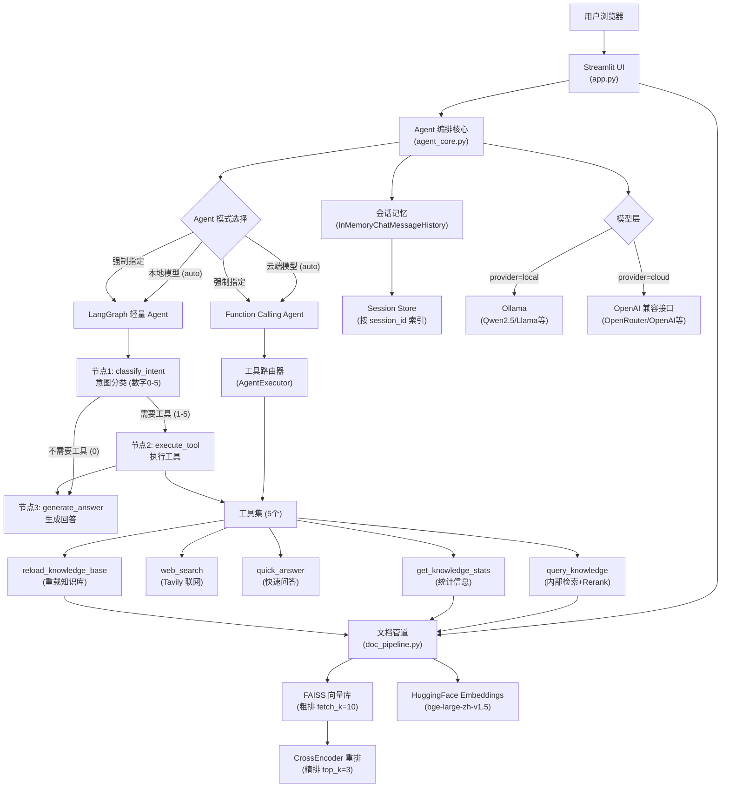

# 企业专属 AI 知识库系统

> 基于 LangChain + LangGraph + RAG + MCP 协议构建的轻量级企业知识库，支持本地部署与云端模型双模式，配备二段重排检索与多轮对话记忆，让企业内部知识真正"活"起来。

---

## 项目定位

企业日常运营中积累了大量文档、政策、流程手册，但这些知识往往"沉睡"在文件夹里，难以快速检索和利用。本项目通过 RAG（检索增强生成）技术，将企业文档向量化存储，结合大语言模型实现自然语言问答，同时支持联网搜索补充外部信息，构建一套完整的企业智能知识助手。

**核心特性**：
- 双 Agent 模式自适应（LangGraph 轻量模式 + Function Calling 模式）
- 二段重排检索（FAISS 粗排 + CrossEncoder 精排）
- 多轮对话记忆（基于 session_id）
- 本地/云端模型灵活切换
- MCP 协议工具扩展

---

## 技术架构



### 核心模块说明

| 模块 | 文件 | 职责 |
|------|------|------|
| 前端界面 | `app.py` | Streamlit UI，文档上传，聊天交互，模型配置，会话管理 |
| Agent 编排 | `agent_core.py` | LangChain Agent，工具注册，模型工厂，LangGraph/Function Calling 双模式，会话记忆 |
| 文档管道 | `doc_pipeline.py` | 文档解析、分块、向量化、FAISS 存储、CrossEncoder 二段重排 |
| 知识库服务 | `mcp_servers/knowledge_server.py` | MCP 协议知识库服务 |
| 搜索服务 | `mcp_servers/search_server.py` | MCP 协议联网搜索服务 |

---

## 核心功能

### 1. RAG 语义检索（二段重排）
- 将企业文档（PDF、Word、Markdown、CSV、TXT）解析并切块
- 使用 `bge-large-zh-v1.5` 中文 embedding 模型向量化
- **粗排阶段**：FAISS 向量数据库检索 Top 10 候选（`fetch_k=10`）
- **精排阶段**：CrossEncoder 重排模型（`BAAI/bge-reranker-base`）二次打分，返回 Top 3（`top_k=3`）
- 检索结果附带来源文件信息，支持溯源

### 2. 双 Agent 模式
系统支持两种 Agent 编排模式，可根据模型能力自动选择或手动指定：

| Agent 模式 | 适用场景 | 特点 |
|-----------|---------|------|
| **LangGraph 轻量 Agent** | 本地小模型（Qwen2.5:7b、Llama 等） | 3 节点 StateGraph，数字路由（0-5），最多 2 次 LLM 调用，低延迟 |
| **Function Calling Agent** | 云端大模型（GPT-4、Claude 等） | 模型原生工具调用，AgentExecutor 编排，最多 15 次迭代 |
| **Auto 模式** | 自动适配 | 本地→LangGraph，云端→Function Calling |

**LangGraph 工作流**：
1. `classify_intent` 节点：分析用户意图，返回工具编号（0-5）
2. 条件分支：0 跳过工具，1-5 执行工具
3. `execute_tool` 节点：调用对应工具获取信息
4. `generate_answer` 节点：基于工具结果生成回答

### 3. 完整工具集（5 个工具）
| 工具 | 功能 | 使用场景 |
|------|------|---------|
| `query_knowledge` | 检索企业内部知识库（带 Rerank） | 查询内部文档、公司资料 |
| `web_search` | 联网搜索（Tavily API） | 获取实时信息、新闻、外部知识 |
| `quick_answer` | 快速问答（网络） | 快速获取网络答案摘要 |
| `get_knowledge_stats` | 知识库统计 | 查询文档数量、存储路径 |
| `reload_knowledge_base` | 重载知识库 | 文档更新后刷新索引 |

回答时自动标注信息来源（内部文档 / 网络搜索）。

### 4. 多轮对话记忆
- 基于 `session_id` 的会话级记忆管理
- 使用 `InMemoryChatMessageHistory` 存储历史消息
- 支持上下文追问和连续对话
- 侧边栏提供三种会话管理操作：
  - **清空显示历史**：清空前端聊天界面
  - **清空 Agent 记忆**：清空当前会话的历史记忆
  - **重置会话**：创建新的 session_id，完全重新开始

### 5. 双模型后端
| 模式 | 适用场景 | 配置 |
|------|---------|------|
| 本地 (Ollama) | 内网环境，数据安全要求高 | 无需 API Key，支持 Qwen2.5、Llama 等 |
| 云端 (OpenRouter) | 快速体验，无本地 GPU | 需要 API Key，支持 GPT-4、Claude 等 |

运行时可在 Streamlit 侧边栏实时切换模型，无需重启服务。UI 自动从 Ollama API 获取已安装模型列表。

### 6. 文档管理
- 支持多文件批量上传
- 自动识别文件格式并调用对应解析器
- 向量化完成后立即可用于检索
- 提供知识库统计（文档片段数、存储路径）
- 支持知识库重载（文档更新后刷新）

---

## 技术亮点

**双 Agent 自适应编排**
根据模型能力自动选择最优 Agent 模式：本地小模型使用 LangGraph 轻量路由（最多 2 次 LLM 调用），云端大模型使用 Function Calling 原生工具调用。也可手动指定模式，满足不同场景需求。

**二段重排检索（Rerank）**
采用"粗排+精排"策略提升检索质量：FAISS 向量库快速召回 Top 10 候选，CrossEncoder 重排模型基于语义相关性精准打分，最终返回 Top 3 最相关片段，显著提升答案准确性。

**会话级记忆管理**
基于 `session_id` 实现多轮对话上下文保持，支持连续追问和上下文理解。提供灵活的会话管理操作（清空显示/清空记忆/重置会话），满足不同使用场景。

**MCP 协议架构**
工具层基于 MCP（Model Context Protocol）协议设计，知识库检索和联网搜索作为独立 MCP Server 运行，Agent 通过标准协议调用。这使得新工具的接入只需新增一个 MCP Server 文件并注册，无需修改核心逻辑。

**数据安全**
Ollama 本地模式下，所有数据（文档、对话、向量）均在本地处理，不经过任何外部网络，满足企业内网安全要求。

**异步架构**
Agent 调用链全程异步（`asyncio`），Streamlit 通过独立线程运行异步代码，避免事件循环冲突，保证 UI 响应流畅。

**中文优化**
- Embedding 模型选用 `BAAI/bge-large-zh-v1.5`，专为中文语义检索优化
- 重排模型使用 `BAAI/bge-reranker-base`，提升中文语义匹配精度
- 文档分块策略针对中文标点（`。`、`；`）进行优化
- 系统提示词强制中文优先回答

---

## 部署方案

### 方案 A：本地 Ollama（推荐内网环境）

```env
LLM_PROVIDER=ollama
OLLAMA_MODEL=qwen2.5:7b
OLLAMA_BASE_URL=http://localhost:11434
TAVILY_API_KEY=your_key  # 可选，用于联网搜索
```

**前置条件**：安装 Ollama 并拉取模型
```bash
ollama pull qwen2.5:7b
```

**Agent 模式**：默认使用 LangGraph 轻量模式（适合小模型）

### 方案 B：云端 OpenRouter（推荐快速体验）

```env
LLM_PROVIDER=openrouter
OPENROUTER_API_KEY=your_key
OPENROUTER_MODEL=qwen/qwen-2.5-72b-instruct
OPENROUTER_BASE_URL=https://openrouter.ai/api/v1
```

**Agent 模式**：默认使用 Function Calling 模式（利用模型原生工具调用能力）

### 启动

Windows 一键启动：
```bash
.\setup.bat   # 首次运行：创建虚拟环境并安装依赖
.\start.bat   # 启动服务
```

或手动启动：
```bash
pip install -r requirements.txt
streamlit run app.py
```

访问 `http://localhost:8501`

---

## 配置说明

### 环境变量（.env）

| 变量 | 说明 | 示例 |
|------|------|------|
| `LLM_PROVIDER` | 模型提供方 | `ollama` / `openrouter` |
| `OLLAMA_MODEL` | Ollama 模型名称 | `qwen2.5:7b` |
| `OLLAMA_BASE_URL` | Ollama API 地址 | `http://localhost:11434` |
| `OPENROUTER_API_KEY` | OpenRouter API Key | `sk-or-v1-...` |
| `OPENROUTER_MODEL` | OpenRouter 模型 | `qwen/qwen-2.5-72b-instruct` |
| `OPENROUTER_BASE_URL` | OpenRouter API 地址 | `https://openrouter.ai/api/v1` |
| `TAVILY_API_KEY` | Tavily 搜索 API Key | `tvly-...` |
| `EMBEDDING_MODEL` | Embedding 模型 | `BAAI/bge-large-zh-v1.5` |
| `EMBEDDING_DEVICE` | 推理设备 | `cpu` / `cuda` |
| `VECTOR_STORE_PATH` | 向量库存储路径 | `./vector_store` |

### Agent 模式配置

在 Streamlit UI 侧边栏可选择：
- **auto**（推荐）：本地模型自动使用 LangGraph，云端模型自动使用 Function Calling
- **langgraph**：强制使用 LangGraph 轻量模式（适合小模型，最多 2 次 LLM 调用）
- **function_calling**：强制使用 Function Calling 模式（需要模型支持工具调用）

### UI 功能说明

**模型设置**：
- 模型类型切换（local/cloud）
- Ollama 模型自动列表（通过 `/api/tags` 接口）
- Base URL 和 API Key 配置
- Temperature 温度调节（0.0-1.0）
- Agent 模式选择（auto/langgraph/function_calling）

**联网搜索**：
- Tavily API Key 配置
- 实时开关控制（输入框上方）

**文档管理**：
- 多文件批量上传（PDF/Word/Markdown/CSV/TXT）
- 知识库统计查看
- 一键导入

**对话管理**：
- 清空显示历史（仅清空前端界面）
- 清空 Agent 记忆（清空当前会话历史）
- 重置会话（创建新 session_id）
- 会话 ID 显示（调试用）

---

## 核心实现细节

### Agent 模式对比

| 特性 | LangGraph 轻量模式 | Function Calling 模式 |
|------|-------------------|---------------------|
| **适用模型** | 小模型（Qwen2.5:7b、Llama 等） | 大模型（GPT-4、Claude 等） |
| **LLM 调用次数** | 最多 2 次（意图分类 + 生成回答） | 动态，最多 15 次迭代 |
| **工具选择方式** | 数字路由（0-5） | 模型原生工具调用 |
| **延迟** | 低（固定流程） | 中等（迭代式） |
| **模型要求** | 无需工具调用能力 | 需要模型支持 Function Calling |
| **适用场景** | 本地部署、成本敏感 | 云端部署、复杂任务 |

### 检索流程（二段重排）

1. **用户提问** → 向量化查询文本
2. **FAISS 粗排** → 召回 Top 10 候选文档片段（基于向量相似度）
3. **CrossEncoder 精排** → 对 10 个候选重新打分（基于语义相关性）
4. **返回 Top 3** → 最相关的 3 个文档片段
5. **Agent 生成** → 基于检索结果生成回答

### 会话记忆机制

- 每个用户会话分配唯一 `session_id`（UUID）
- 历史消息存储在 `_session_store` 字典中（进程内内存）
- LangGraph 模式：通过 `LangGraphAgentWrapper` 手动管理历史
- Function Calling 模式：通过 `RunnableWithMessageHistory` 自动管理历史
- 重启服务后会话记忆丢失（未持久化）

---

## 使用场景

- **企业政策问答**：上传 HR 手册、规章制度，员工直接提问（支持多轮追问）
- **技术文档检索**：上传 API 文档、架构设计，开发者快速查阅（二段重排提升精度）
- **项目知识沉淀**：上传会议纪要、项目文档，新成员快速上手（会话记忆保持上下文）
- **混合信息查询**：内部知识 + 实时网络信息联合回答（智能工具路由）
- **内网安全部署**：本地 Ollama 模式，数据不出内网（满足合规要求）

---

## 技术栈

| 类别 | 技术 |
|------|------|
| 语言/运行时 | Python 3.9+ (推荐 3.12) |
| 前端 | Streamlit |
| Agent 框架 | LangChain 0.3+, LangGraph |
| Agent 模式 | Function Calling (AgentExecutor) + LangGraph (StateGraph) |
| 本地模型 | Ollama + Qwen2.5 / Llama |
| 云端模型 | OpenRouter / OpenAI 兼容接口 |
| 模型接入 | langchain-ollama, langchain-openai, langchain-openrouter |
| 向量数据库 | FAISS (CPU) |
| Embedding | BAAI/bge-large-zh-v1.5 (HuggingFace) |
| 重排模型 | CrossEncoder (BAAI/bge-reranker-base) |
| 文档解析 | pypdf, docx2txt, unstructured, python-magic-bin |
| 联网搜索 | Tavily API |
| HTTP 客户端 | httpx (异步), requests (同步) |
| 工具协议 | MCP Python SDK (FastMCP) |
| 配置管理 | python-dotenv |
| 会话记忆 | InMemoryChatMessageHistory (进程内) |
| 兼容层 | langchain_classic 回退到 langchain.agents |

---

## 迭代规划

| 阶段 | 目标 | 状态 |
|------|------|------|
| P0 - MVP | RAG 问答 + 文档上传 + 双模型支持 | ✅ 已完成 |
| P1 - 功能增强 | 多轮对话记忆、双 Agent 模式、二段重排、完整工具集 | ✅ 已完成 |
| P2 - 质量提升 | 混合检索、配置持久化、日志可观测性 | 🔄 规划中 |
| P3 - 体验优化 | 用户权限系统、审计日志 | 📋 待开发 |
| P4 - 生产部署 | Docker 容器化、监控告警、性能优化 | 📋 待开发 |

---

## 项目结构

```
AI智能体/
├── app.py                          # Streamlit 前端入口
├── agent_core.py                   # LangChain Agent 编排核心 (LangGraph + Function Calling)
├── doc_pipeline.py                 # 文档处理、向量化、CrossEncoder 重排
├── mcp_servers/
│   ├── knowledge_server.py         # 知识库 MCP Server
│   └── search_server.py            # 联网搜索 MCP Server
├── vector_store/                   # FAISS 向量库（自动生成）
├── models/                         # 本地 Embedding 模型缓存
├── requirements.txt                # Python 依赖
├── .env.example                    # 环境变量模板
├── setup.bat                       # Windows 一键安装脚本
├── start.bat                       # Windows 一键启动脚本
├── download_embedding_model.py     # Embedding 模型下载工具
├── test_langgraph_agent.py         # LangGraph Agent 测试
├── test_model_tools.py             # 模型与工具测试
├── test_react_fix.py               # ReAct Agent 测试
├── test_upgrade.py                 # 升级测试
├── README.md                       # 执行计划版 README
├── QUICKSTART.md                   # 快速开始指南
├── QUICKSTART_LANGGRAPH.md         # LangGraph 快速开始
├── LANGGRAPH_GUIDE.md              # LangGraph 详细指南
├── IMPLEMENTATION_SUMMARY.md       # 实现总结
└── venv312/                        # Python 虚拟环境
